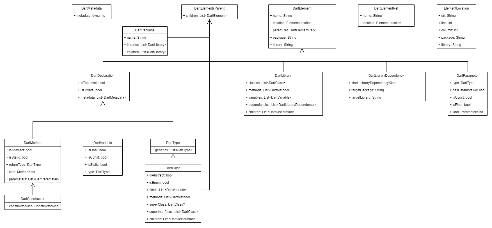

# Arch Test
Arch test is a package used to create architecture tests for a dart application.

# Getting started
To start creating architecture tests you first need to create a test file, usually it is a file named `arch_test.dart` at the root of your `test` folder. 

In this file you will need to import the main library from your package. Without this, this package won't be able to find any elements from your package.
```dart
// at test/arch_test.dart
import 'package:my_package/main.dart';

void main() {
  // You'll write your tests here
}
```

Then, you'll import arch_test's main file, it provides all methods and classes you'll need to create your tests.
Use the function `archTest` passing an `ArchRule` as argument to run your tests.
You can create `ArchRule`s both fluently and as normal objects.
```dart
// at test/arch_test.dart
import 'package:my_package/main.dart';
import 'package:arch_test/arch_test.dart';

void main() {
  // Fluent testing
  archTest(classes.that
    .areInsideFolder('entity')
    .should
    .extendClass<BaseEntity>(),
  );
  // Creating ArchRule as normal object using premade helpers
  archTest(ArchRule(
    selector: Selectors.classes,
    filter: Filters.insideFolder('entity'),
    validation: Validations.extendClass<BaseEntity>(),
  ));
}
```
When using `archTest`, it will automatically load your package's structure, and create a test with a name based on the `ArchRule` you provide to it, for example, both the tests above would be named `classes THAT are inside folder "entity" SHOULD extend BaseEntity`.

# Package Layers
This package is divided into three layers of abstraction:
* **[Core](#core)**: Responsible for translating the dart mirror system to an internal and more friendly class hierarchy. You can use this layer to have the most flexible way of testing, but you'll also need to write a lot more code;
* **[Testing](#testing)**: Provides base classes for testing for standardizing your tests. A most structured way of testing, but still not as simple and fluid as Fluent;
* **[Fluent](#fluent)**: Provides an easy and human-readable way to create your tests. This should be your go-to way of testing.

You can see how to use each of these layers in the following sections.

## Core
The core layer provider the package's base models and components to trasform your package's source code to these models.

Here you can see the which models there are, as well as their fields and hierarchy:


The components are `DartPackageLoader`, which is responsible for loading a package's code structure, and `DartElementFinder`, which was created to help with finding elements within a package's code structure.

[See how a loaded package looks like](./example/core_example/test/arch_test.dart).

### Testing With Core
if you want maximum flexibility when testing, you should use the core layer to create your tests.

To do this, you'll first need to load your package's code structure, then find which elements you want to test, and finally, make your asserts.

```dart
// Import your package's main file, 
// otherwise DartPackageLoader won't be able to find your code
import 'package:my_package/main.dart'; 
import 'package:test/test.dart';
// You can import only the core layer if want
import 'package:arch_test/core.dart'; 

void main() {
  late DartPackage package;
  setUp(() async {
    package = await DartPackageLoader.instance.loadCurrentPackage();
  });
  test('all entities should extend BaseEntity', () {
    final entities = findEntities();
    for (final entity in entities) {
      expect(entity.superClass, isNotNull, reason: 'Entities should extend BaseEntity');
      expect(entity.superClass!.name, 'BaseEntity', reason: 'Entities should extend BaseEntity');
    }
  });
  List<DartClass> findEntities() {
    // Easy way
    return DartElementFinder.instance.findByMatcher(
      matcher: (el) => el is DartClass && !el.isEnum,
      source: package,
    ).where((cls) => cls.library.split('/').contains('entities'));
    /* Hard way
    final entities = [];
    final entityLibraries = package.libraries
      .where((lib) => lib.name.split('/').contains('entities')
      .toList();
    for (final entityLibrary in entityLibraries) {
      for (final cls in entityLibrary.classes) {
        if (!cls.isEnum) {
          entities.add(cls);
        }
      }
    }
    return entities;
    */
  }
}
```
If you want more examples on how to use core for testing, take a look at the [testing_with_core](./example/testing_with_core) example.
## Testing
The testing layer provides a few classes to standardize how you create and describe your tests, as well as your architecture's violations. Those classes are `ArchRule`, `Selector`, `Filter` and `Validation`.

`ArchRule` defines the base test structure, using `Selector`s to query which elements will be tested (for example, classes, methods, libraries, etc), `Filter`s to filter the queried elements, and `Validation`s to verify if these elements follow the architecture you defined. You can also combine multiple filters or validations using the methods `and` and `or`.

This layer also provides premade `Selectors`, `Filters` and `Validations` to help you write smaller code, and a method `archTest` to help you write less boilerplate and standardize your tests names.

### Testing With Testing
Here you'll have a structured but still flexible way of testing.
```dart
// Import your package's main file, 
// otherwise DartPackageLoader won't be able to find your code
import 'package:my_package/main.dart'; 
import 'package:test/test.dart';
// Here you'll need core if you're not using the archTest method
import 'package:arch_test/core.dart'; 
import 'package:arch_test/testing.dart'; 

void main() {
  // Using premades
  archTest(ArchRule<DartClass>(
    selector: Selectors.classes,
    filter: Filters.insideFolder('entities'),
    validation: Validations.extendClass<BaseEntity>(),
  ));
  // Writing everything
  test('classes that are inside folder "entities" should extend BaseEntity', () async {
    final package = await DartPackageLoader.instance.loadCurrentPackage();
    ArchRule(
      selector: Selector(
        (package) => DartElementFinder.instance.findByMatcher(
          matcher: (el) => el is DartClass && !el.isEnum,
          source: package,
        ),
        description: 'classes',
      ),
      filter: Filter(
        (el) => el.library.split('/').contains('entities'),
        description: 'are inside folder "entities"',
      ),
      validation: Validation(
        (el, addViolation) {
          if (el.superClass == null) {
            addViolation('Does not have super class');
          }
          if (el.superClass.name != 'BaseEntity') {
            addViolation('Should extend BaseEntity');
          }
        },
        description: 'should extend BaseEntity',
      ),
    ).validate(package);
  });
}
```
This is an example output of a failed test using `ArchRule`:
```
Found the following violations in package my_package:

Violations of SomeEntity (located at package:my_package/path/to/some_entity.dart:1:1):
- Does not have super class
- Should extend BaseEntity
```
If you want more examples on how to use testing for testing, take a look at [testing_with_testing](./example/testing_with_testing) example.
## Fluent
The fluent layer provides a fluent API for creating `ArchRule`s.

You can use the following top-level constants to start your rules: `classes`, `enums`, `methods` and `libraries`. From there you can use `that` and `should` to add filters and validations to your tests, as well as `and` and `or` to combine them. Note that `that` and `should` are callable classes, so you can use custom classes on the fluent API too.

### Testing With Fluent
This is the fastest and most human-friendly way to write your tests, and still has some flexibility.
```dart
// Import your package's main file, 
// otherwise DartPackageLoader won't be able to find your code
import 'package:my_package/main.dart';
// Here you'll need testing for the archTest method
import 'package:arch_test/testing.dart'; 
import 'package:arch_test/fluent.dart'; 

void main() {
  // Using premades
  archTest(classes.that.areInsideFolder('entities').should.extendClass<BaseEntity>());
  
  // Writing and combining custom filters/validations
  archTest(classes
    .that(Filter((el) => el.name.endsWith('Entity'), description: 'have name ending with Entity'))
    .and(Filter((el) => el.name != 'BaseEntity'), description: 'are not BaseEntity'))
    .should(Validation((el, addViolation) {
      if (el.superClass == null || el.superClass.name != 'BaseEntity') {
        addViolation('Should extend BaseEntity');
      }
    }, description: 'should extend BaseEntity'))
    .or(Validation((el, addViolation) {
      if (el.library.split('/').contains('entities')) {
        addViolation('Should be outside of "entities" folder');
      }
    }, description: 'should be outside of "entities" folder')),
  );
}
```
If you want more examples on how to use fluent for testing, take a look at [testing_with_fluent](./example/testing_with_fluent) example.